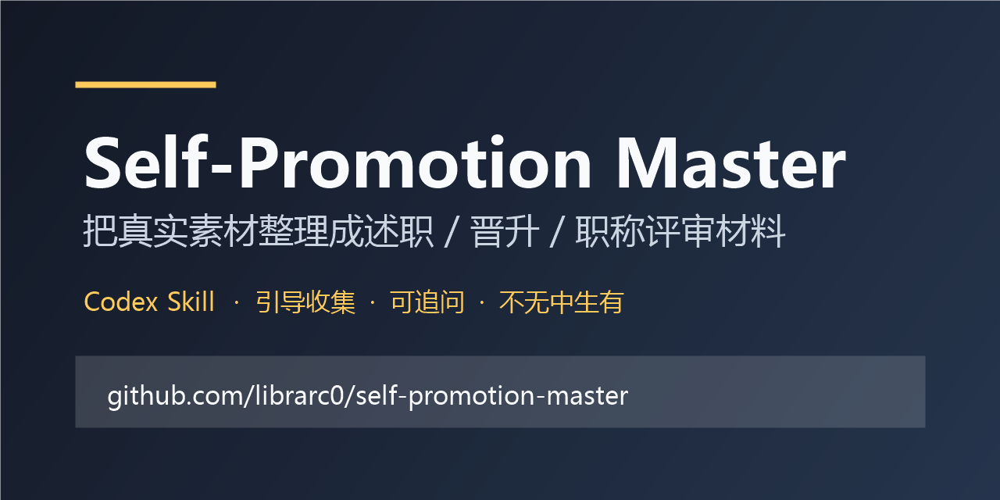

# Self-Promotion Master · 包装大师

> 把真实经历整理成更有冲击力、可追问、不过度虚构的述职、晋升、职称评审、面试和答辩材料。


<p align="center">
  
</p>

> **Read this in:** [English](#english-version) | [中文](README.md)

---

## 快速体验

把这个 Skill 交给 Codex / ChatGPT 类代理后，可以直接这样说：

```text
使用 self-promotion-master 开启引导模式。
我想准备一次晋升答辩，但现在只有零散素材。
请先问我问题，确认需求后再生成最终稿。
```

它会先确认场景、受众、时长、强度、素材和事实边界，再生成文档。

### Before / After

**原始表达**

> 我参与了一个系统重构，修了一些性能问题，也写了几篇文档。

**包装后**

> 在核心系统重构项目中，我负责性能优化与工程规范沉淀两个模块：一方面定位关键链路瓶颈，推动接口响应时间显著下降；另一方面整理重构过程中的技术决策和排障经验，形成可复用文档，降低后续维护和新人接手成本。

这不是编造经历，而是把“做了什么”改写成“解决了什么问题、产生了什么价值、留下了什么资产”。

### 项目入口

- 主 Skill：[SKILL.md](SKILL.md)
- 场景索引：[references/INDEX.md](references/INDEX.md)
- 职称评审模板：[references/scenario-title-review.md](references/scenario-title-review.md)
- 完整案例：[examples/](examples/)

---

## 这是什么？

**Self-Promotion Master** 是一个面向职场人士的"自我展示"方法论 + 文本生成 skill。

不管你是要写：

- 📝 年度述职 / 半年总结
- 🚀 晋升答辩 / 竞聘上岗
- 🏅 职称评审（初级 / 中级 / 高级 / 正高级）
- 🤝 自我介绍（30秒 / 1分钟 / 3分钟 / 群面版）
- 💼 求职面试 / 求职信
- 🎓 答辩 / 开题 / 论文陈述
- 🗣️ 即兴发言 / 抢答 / 圆桌
- 🥂 校友会 / 社交破冰

这套方法论都能帮你**把已经做过的事，讲得让人眼前一亮**。

**它不是教你撒谎，而是教你"基于事实的放大"** —— 用合适的动词、合适的维度、合适的包装，让评委/听众看到你**真正的价值**，而不是你朴实无华的自我描述。

---

## GitHub Topics 建议

如果你 fork 或二次发布，建议给仓库添加这些 topics，方便被搜索到：

`codex-skill`, `chatgpt`, `prompt`, `career`, `workplace`, `self-promotion`, `performance-review`, `promotion`, `interview`, `title-review`, `chinese`, `writing-assistant`

---

## 核心特性

| 特性                       | 说明                                                               |
| -------------------------- | ------------------------------------------------------------------ |
| 🎯**五大吹嘘武器**   | 动词升级器 · 数据锚定器 · 维度拔高器 · 故事包装器 · 价值闭环器 |
| 🏛️**四类调性切换** | 🏫 学校 · 🏛️ 国央企 · 💼 私企 · 🌍 外企，一套方法论，N 种场合 |
| 🎚️**三档吹嘘强度** | 🟢 保守 · 🟡 标准（默认）· 🔴 激进，让用户自己选                 |
| 🔄**四种使用模式**   | 引导收集 · 白纸生成 · 草稿润色 · 素材提炼                       |
| 📤**自适应输出**     | 完整稿三件套；短句/单段轻量输出；引导模式先确认需求                |
| ✅**可追问原则**     | 所有"吹"必须可追问、可佐证，绝不无中生有                           |

---

## 快速开始

### 1. 把你的"原料"准备好

不管你是要**先被引导梳理需求**、**从 0 生成**、**润色已有草稿**，还是**提炼零散素材**，都可以先准备：

- **场景**：晋升答辩？述职？自我介绍？
- **场合**：私企 / 国央企 / 外企 / 学校？
- **核心素材**：你做过什么、有什么数据、带过几个人、有什么成果

### 2. 选择一个使用模式

**模式 0：引导收集（先问后写）**

```
开启引导模式，先通过问题帮我确认实际需求，再生成对应文档。
我目前只知道大概要用于晋升/述职/面试，但素材还比较散。
```

Skill 会分轮确认：产物类型、使用场合、受众、时长/字数、核心素材、表达强度、事实边界。确认摘要无误后，再生成最终文档。

**模式 A：白纸生成（从 0 到 1）**

```
【场景】晋升答辩
【场合】私企互联网
【受众】技术总监 + HRBP
【时长】10 分钟
【核心素材】
- 主导了 XX 系统重构
- 带过 2 个实习生
- 申请了 1 项专利
- 业务方满意度从 3.5 提升到 4.6
【吹嘘强度】标准
【特别要求】突出技术深度 + 业务结果 + 带人能力
```

**模式 B：草稿润色（从 1 到 10）**

```
【润色下列文本】
<你的草稿>

【目标场景】年度述职
【场合】国央企
【吹嘘强度】激进
【特别要求】加入政治站位
```

**模式 C：素材提炼（从散到整）**

```
【素材如下，请提炼成晋升答辩稿】
<粘贴你的聊天记录 / 周报 / 邮件>

【场景】晋升答辩
【场合】私企
【时长】8 分钟
【强度】标准
```

### 3. 接收输出

如果是完整稿件，你会得到三样东西：

1. **润色后文本** —— 可以直接用
2. **关键改动说明** —— 表格列出"原文 vs 润色后"，告诉你用了什么武器
3. **评委追问预案** —— 3 个评委可能问的 Q&A，提前演练

如果是引导模式，会先得到“需求确认摘要”；如果是短句/单段润色，会得到轻量版本和风险提示。

---

## 五大吹嘘武器速览

| 武器                   | 一句话                         | 举例                                          |
| ---------------------- | ------------------------------ | --------------------------------------------- |
| 🔫**动词升级器** | 同样事实，换个动词像换个人     | 做了 → 主导 / 操盘 / 牵头搭建                |
| 📊**数据锚定器** | 数字是最硬的"吹嘘货币"         | "销售额 800 万" → "超额完成 KPI 33%，Top 5"  |
| 🚀**维度拔高器** | 把自己做的事"往上看三层"       | 我做了什么 → 对团队/部门/公司/行业有什么价值 |
| 📖**故事包装器** | 平铺直叙 = 平庸，故事化 = 高手 | 背景冲突 + 我做了什么 + 转折 + 价值升华       |
| 🔄**价值闭环器** | 评委要的是"带来了什么"         | 输入 → 动作 → 输出 → 影响 → 可复用        |

> 详细说明见 [`SKILL.md`](SKILL.md)

---

## 场合调性矩阵

不同场合，"吹"的语言风格完全不同。错配 = 翻车。

| 场合                 | 核心风格            | 必带关键词                            | 必避雷区               |
| -------------------- | ------------------- | ------------------------------------- | ---------------------- |
| 🏫**学校**     | 严谨规范、师承有根  | 理论贡献、创新点、填补空白            | 商业化表达、领导力吹嘘 |
| 🏛️**国央企** | 政治站位、突出集体  | 党建引领、攻坚克难、保值增值          | 太商业、个人英雄主义   |
| 💼**私企**     | 结果导向、数字说话  | ROI、增长、owner 意识、闭环           | 太官腔、太虚、卖惨     |
| 🌍**外企**     | Impact-Driven、STAR | Impact、Stakeholder、Cross-functional | 政治化、集体主义过度   |

> 详细见 [`references/tones-*.md`](references/INDEX.md)

---

## 强度档位速记

| 档位                     | 适合                   | 风格                       |
| ------------------------ | ---------------------- | -------------------------- |
| 🟢**保守**         | 央企 / 外企 / 正式答辩 | 数字 + 升维，措辞克制      |
| 🟡**标准**（默认） | 日常述职、晋升、面试   | 动词升级 + 故事 + 价值闭环 |
| 🔴**激进**         | 群面、抢答、社交       | 拔高格局 + 敢下判断 + 留白 |

---

## 完整使用案例

我们准备了 5 个真实场景的完整案例，每个都包含"原始版 / 标准版 / 激进版"三档对比：

- 📌 [私企产品经理晋升答辩](examples/promotion/promotion-pm-private.md)
- 📌 [国央企综合岗述职](examples/review/review-comprehensive-state.md)
- 📌 [外企工程师 Performance Review](examples/review/review-engineer-foreign.md)
- 📌 [群面自我介绍](examples/intro/intro-group-interview.md)
- 📌 [博士论文答辩](examples/intro/intro-phd-defense.md)

> 完整 before/after 案例集：[`references/polish-examples.md`](references/polish-examples.md)

---

## 目录结构

```
self-promotion-master/
├── README.md                       # 你正在看的
├── SKILL.md                        # 主方法论入口（必读）
├── LICENSE                         # MIT
├── CHANGELOG.md                    # 更新日志
├── CONTRIBUTING.md                 # 贡献指南
├── CODE_OF_CONDUCT.md              # 行为准则
├── SECURITY.md                     # 安全策略
├── .gitignore
├── references/                     # 详细参考资料
│   ├── INDEX.md                    # 速查索引
│   ├── tones-state.md              # 国央企调性
│   ├── tones-private.md            # 私企调性
│   ├── tones-foreign.md            # 外企调性（STAR 框架）
│   ├── tones-school.md             # 学校/学术调性
│   ├── scenario-promotion.md       # 晋升答辩模板
│   ├── scenario-title-review.md    # 职称评审模板
│   ├── scenario-intro.md           # 自我介绍模板
│   ├── scenario-review.md          # 述职汇报模板
│   ├── scenarios-others.md         # 求职/答辩/即兴/社交
│   └── polish-examples.md          # 10 个 before/after 案例
├── examples/                       # 完整真实案例
│   ├── promotion/
│   ├── review/
│   └── intro/
└── .github/                        # Issue & PR 模板
```

---

## 贡献指南

我们欢迎任何形式的贡献：

- 🐛 报告 bug / 提出 issue
- 💡 建议新场景 / 新调性 / 新武器
- 📝 补充更多 before/after 案例
- 🌐 翻译到其他语言
- ✏️ 润色现有内容

请先阅读 [`CONTRIBUTING.md`](CONTRIBUTING.md) 和 [`CODE_OF_CONDUCT.md`](CODE_OF_CONDUCT.md)。

---

## 路线图

- [X] v1.0 — 核心方法论 + 4 类调性 + 3 档强度
- [ ] v1.1 — 增加"互联网大厂"细分调性
- [ ] v1.2 — 增加"金融/咨询"细分调性
- [ ] v2.0 — 增加"AI 自动生成"工作流（Claude / GPT prompt 模板）
- [ ] v2.1 — 多语言支持（English / Japanese）
- [ ] v3.0 — Web 交互式应用

---

## 重要承诺

> ⚠️ **本 skill 严格遵守"放大真实"原则，绝不鼓励"无中生有"。**

- ❌ 不会教你捏造数字、奖项、合作伙伴
- ❌ 不会教你抢同事的功劳
- ❌ 不会教你吹到评委无法相信的程度
- ✅ 所有"吹"必须可追问、可佐证
- ✅ 数字模糊时用"显著/大幅/数量级"代替具体值
- ✅ 升维要看场合：外企别升到"国家战略"，学校别讲"商业化"

**我们相信：一个能经得起追问的吹嘘，永远比一个当场被戳穿的吹牛更值钱。**

---

## 致谢

- 灵感来源于无数前职场人"吃亏后总结的经验"
- 感谢所有贡献者
- Made with ❤️ for 职场牛马人

---

## 许可证

本项目采用 [MIT License](LICENSE) 协议。

---

## English Version

**Self-Promotion Master** — a methodology + text-generation skill for workplace self-presentation.

It helps you turn "I did some work" into "I delivered measurable impact" across:

- Annual reviews
- Promotion pitches
- Professional title reviews
- Self-introductions
- Job interviews
- Thesis defenses
- Impromptu speeches
- Social small talk

**Five Core Weapons**: verb upgrade · data anchoring · dimension elevation · story packaging · value-closed-loop

**Four Tones**: 🏫 Academia · 🏛️ State-owned · 💼 Private · 🌍 Foreign

**Three Intensity Levels**: 🟢 Conservative · 🟡 Standard (default) · 🔴 Aggressive

**Ethical Promise**: We amplify truth. We never fabricate.

For full English documentation, see [CONTRIBUTING.md](CONTRIBUTING.md) → "Internationalization".
